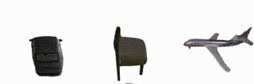
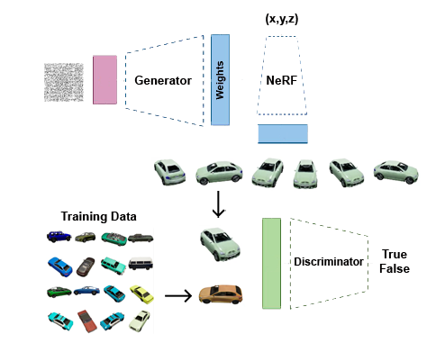

## HyperNeRFGAN: Hypernetwok approach to 3D NeRF GAN

 

This repo contains implementation of ["HyperNeRFGAN: Hypernetwok approach to 3D NeRF GAN"](https://arxiv.org/abs/2301.11631). It's built on top of [INR-GAN](https://github.com/universome/inr-gan).
The main idea behind HyperNeRFGAN is that the generator network is [INR](https://vsitzmann.github.io/siren/)-based, i.e. it produces parameters for a fully-connected neural network which implicitly represents a 3D object.

<div style="text-align:center">

</div>

### Installation
To install, run the following command:
```
conda env create --file environment.yaml --prefix ./env
conda activate ./env
```

### Training
To train the model, navigate to the project directory and run:
```
python src/infra/launch_local.py hydra.run.dir=. +experiment_name=my_experiment_name +dataset.name=dataset_name num_gpus=1
```
where `dataset_name` is the name of the dataset without `.zip` extension inside `data/` directory (you can easily override the paths in `configs/main.yml`).
So make sure that `data/dataset_name.zip` exists and should be a plain directory of images.
See [StyleGAN2-ADA](https://github.com/NVlabs/stylegan2-ada-pytorch) repo for additional data format details.
This training command will create an experiment inside `experiments/` directory and will copy the project files into it.
This is needed to isolate the code which produces the model.

Before training on a given `<dataset>`, modify `configs/main.yml` so that "hydra_cfg_name" points to an apprioriate configuration file. Configuration files for different datasets are located in `configs` folder and follow this naming scheme: `nerf-gan-<dataset>.yml`.

### Pretrained models
Models pretrained on the CARLA dataset and ShapeNet dataset (cars, planes, chairs) can be found [here](https://ujchmura-my.sharepoint.com/:f:/g/personal/przemyslaw_spurek_uj_edu_pl/Eq2ERdmsa99FocBQaKFP8UMByy_eFbqZyWz4_71waM51EQ?e=IOJ5Yg). Use `examples_from_pickle.py` to generate images using a pretrained model:
```
cd src
python examples_from_pickle.py
```
This script will load a pickle from `data/pickles` and save image and interpolation samples in folder `samples`. 
By default, the code loads a model trained on CARLA.

### Data format
We use the same data format as the original [StyleGAN2-ADA](https://github.com/NVlabs/stylegan2-ada-pytorch) repo: it is a zip of images.
It is assumed that all data is located in a single directory, specified in `configs/main.yml`.

We also provide downloadable links to datasets:
- CARLA (rescaled): [https://ujchmura-my.sharepoint.com/:u:/g/personal/przemyslaw_spurek_uj_edu_pl/ETLL6rymGWlErix5HEkiNsUB4YHzLbX4aM5Die52vvlefA?e=29aOCM](https://ujchmura-my.sharepoint.com/:u:/g/personal/przemyslaw_spurek_uj_edu_pl/ETLL6rymGWlErix5HEkiNsUB4YHzLbX4aM5Die52vvlefA?e=29aOCM)
- ShapeNet Cars: [https://ujchmura-my.sharepoint.com/:u:/g/personal/przemyslaw_spurek_uj_edu_pl/EQsJBo43ihBBmMiRnjQGJ1UB3D-BVvioCFXBzl7E5BtPdQ?e=L8lQIp](https://ujchmura-my.sharepoint.com/:u:/g/personal/przemyslaw_spurek_uj_edu_pl/EQsJBo43ihBBmMiRnjQGJ1UB3D-BVvioCFXBzl7E5BtPdQ?e=L8lQIp)
- ShapeNet Planes: [https://ujchmura-my.sharepoint.com/:u:/g/personal/przemyslaw_spurek_uj_edu_pl/ESvo9ADxX3JFvICAyDB-m_IBhN3R6tA4rJSCtUbyISXl7A?e=fKjwHR](https://ujchmura-my.sharepoint.com/:u:/g/personal/przemyslaw_spurek_uj_edu_pl/ESvo9ADxX3JFvICAyDB-m_IBhN3R6tA4rJSCtUbyISXl7A?e=fKjwHR)
- ShapeNet Chairs: [https://ujchmura-my.sharepoint.com/:u:/g/personal/przemyslaw_spurek_uj_edu_pl/EVEQs74umWtBjRlvuKzJAuwBIDwKxtMLSggFJEF4wL-1zA?e=WYwc6k](https://ujchmura-my.sharepoint.com/:u:/g/personal/przemyslaw_spurek_uj_edu_pl/EVEQs74umWtBjRlvuKzJAuwBIDwKxtMLSggFJEF4wL-1zA?e=WYwc6k)

Download the datasets and put them into `data/` directory.

### License
This repo is built on top of [INR-GAN](https://github.com/universome/inr-gan) repo, so I assume it is restricted by the [NVidia license](https://nvlabs.github.io/stylegan2-ada-pytorch/license.html).

### Bibtex
```
@misc{kania2023hypernerfgan,
      title={HyperNeRFGAN: Hypernetwork approach to 3D NeRF GAN}, 
      author={Adam Kania and Artur Kasymov and Maciej Zięba and Przemysław Spurek},
      year={2023},
      eprint={2301.11631},
      archivePrefix={arXiv},
      primaryClass={cs.CV}
}
```
